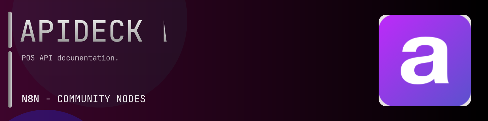

# @n8n-dev/n8n-nodes-apideck-pos



[](https://www.npmjs.com/package/@n8n-dev/n8n-nodes-apideck-pos)
[](https://opensource.org/licenses/MIT)

---

**Stop writing apideck-pos API integrations by hand.**

Every time you connect n8n to apideck-pos, you waste hours mapping endpoints, defining parameters, and debugging schemas. You copy-paste from docs, fix edge cases, and pray nothing breaks.

**What if connecting n8n to apideck-pos took 5 minutes, not half a day?**

This node gives you **9+ resources** out of the box: **Orders**, **Payments**, **Merchants**, **Locations**, **Items**, and 4 more: with full CRUD operations, typed parameters, and zero manual configuration.

---

## What You Get

- **Zero boilerplate**: Resources, operations, and fields are pre-configured and ready to use
- **Full CRUD**: Create, read, update, and delete support where the API allows it
- **Typed parameters**: No more guessing field types
- **Built-in auth**: API key authentication, ready to go
- **Declarative**: Native n8n performance, no custom execute() overhead

---

## Install

```bash
npm install @n8n-dev/n8n-nodes-apideck-pos
```

**Or in n8n:**
1. **Settings → Community Nodes → Install**
2. Search: `@n8n-dev/n8n-nodes-apideck-pos`
3. Click **Install**

---

## Quick Start

1. Install the node (above)
2. Add credentials: **apideck-pos API** → paste your API key
3. Drag the **apideck-pos** node into your workflow
4. Pick a resource → pick an operation → done.

That's it. No configuration files. No code. It just works.

---

## Resources

<details>
<summary><b>Orders</b> (6 operations)</summary>

- Get List Orders
- Post Create Order
- Delete Order
- Get Order
- Patch Update Order
- Post Pay Order

</details>

<details>
<summary><b>Payments</b> (5 operations)</summary>

- Get List Payments
- Post Create Payment
- Delete Payment
- Get Payment
- Patch Update Payment

</details>

<details>
<summary><b>Merchants</b> (5 operations)</summary>

- Get List Merchants
- Post Create Merchant
- Delete Merchant
- Get Merchant
- Patch Update Merchant

</details>

<details>
<summary><b>Locations</b> (5 operations)</summary>

- Get List Locations
- Post Create Location
- Delete Location
- Get Location
- Patch Update Location

</details>

<details>
<summary><b>Items</b> (5 operations)</summary>

- Get List Items
- Post Create Item
- Delete Item
- Get Item
- Patch Update Item

</details>

<details>
<summary><b>Modifiers</b> (5 operations)</summary>

- Get List Modifiers
- Post Create Modifier
- Delete Modifier
- Get Modifier
- Patch Update Modifier

</details>

<details>
<summary><b>Modifier Groups</b> (5 operations)</summary>

- Get List Modifier Groups
- Post Create Modifier Group
- Delete Modifier Group
- Get Modifier Group
- Patch Update Modifier Group

</details>

<details>
<summary><b>Order Types</b> (5 operations)</summary>

- Get List Order Types
- Post Create Order Type
- Delete Order Type
- Get Order Type
- Patch Update Order Type

</details>

<details>
<summary><b>Tenders</b> (5 operations)</summary>

- Get List Tenders
- Post Create Tender
- Delete Tender
- Get Tender
- Patch Update Tender

</details>

---

## Why This Node?

**Without this node:**
- Hours of manual API integration
- Copy-pasting from apideck-pos docs
- Debugging auth, pagination, error handling
- Maintaining your own client code

**With this node:**
- Install → configure → use. 5 minutes.
- Auto-generated from the official apideck-pos OpenAPI spec
- Always up to date when the API changes
- Native n8n performance

---

## Auto-Generated
This node was auto-generated from the official **apideck-pos** OpenAPI specification using
[@n8n-dev/n8n-openapi-node-ultimate](https://github.com/kelvinzer0/n8n-openapi-node-ultimate),
then validated against the live API so you get accurate types and real parameters, not guesswork.

When the apideck-pos API updates, this node updates too.

---

## Support This Project

If this node saved you hours of work, consider supporting continued development, new APIs, better error handling, and faster updates.

[](https://n8n-code.github.io/membership/#/eyJ0aXRsZSI6IktlZXAgSXQgTW92aW5nIiwiZGVzYyI6Ik9uZSBkZXZlbG9wZXIgYnVpbHQgYSB0b29sIHRoYXQgYXV0by1nZW5lcmF0ZXNcbm44biBub2RlcyBmcm9tIGFueSBPcGVuQVBJIHNwZWMuXG5cbllvdXIgZG9uYXRpb24gZnVuZHMgbmV3IGZlYXR1cmVzLCBtb3JlIEFQSSBzdXBwb3J0LFxuYW5kIGJldHRlciB0b29saW5nIGZvciBldmVyeSBkZXZlbG9wZXIgYWZ0ZXIgeW91LiIsInRhcmdldCI6NTAwMCwiYWRkcmVzc2VzIjp7ImV0aGVyZXVtIjoiMHhmMDU1NWQ0MGRiRkI0ZTNCZjA3MDQ0MjgyQjc4RjJmRTFmNTFFZjcyIiwic29sYW5hIjoiNlpEVk5BYmpZZExEcXo4cGt3VUNHYllaNVV3QlFranB0QzU1Wk5vTFcybVUifSwiZGlzY29yZCI6Imh0dHBzOi8vZGlzY29yZC5nZy9wdERaOGU0aDkzIn0)

---

## License

MIT © [kelvinzer0](https://github.com/n8n-code)
